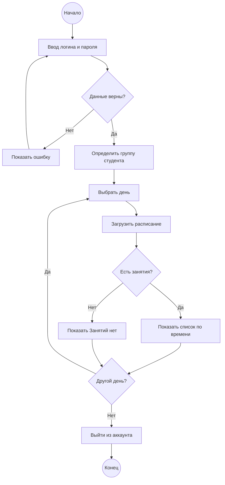
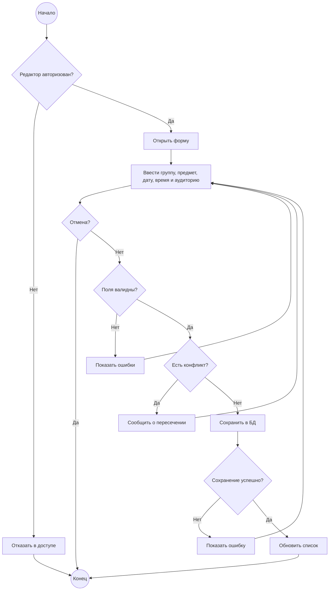

# UML — диаграммы деятельности

## Просмотр расписания

```mermaid
flowchart TD
    A((Начало)) --> B[Ввод логина и пароля]
    B --> C{Данные верны?}
    C -->|Нет| D[Показать ошибку]
    D --> B
    C -->|Да| E[Определить группу студента]
    E --> F[Выбрать день]
    F --> G[Загрузить расписание]
    G --> H{Есть занятия?}
    H -->|Да| I[Показать список по времени]
    H -->|Нет| J[Показать Занятий нет]
    I --> K{Другой день?}
    J --> K
    K -->|Да| F
    K -->|Нет| L[Выйти из аккаунта]
    L --> M((Конец))
```

## Добавление занятия

```mermaid
flowchart TD
    A((Начало)) --> B{Редактор авторизован?}
    B -->|Нет| C[Отказать в доступе]
    C --> Z((Конец))
    B -->|Да| D[Открыть форму]
    D --> E[Ввести группу, предмет, дату, время и аудиторию]
    E --> F{Отмена?}
    F -->|Да| Z
    F -->|Нет| G{Поля валидны?}
    G -->|Нет| H[Показать ошибки]
    H --> E
    G -->|Да| I{Есть конфликт?}
    I -->|Да| J[Сообщить о пересечении]
    J --> E
    I -->|Нет| K[Сохранить в БД]
    K --> L{Сохранение успешно?}
    L -->|Нет| M[Показать ошибку]
    M --> E
    L -->|Да| N[Обновить список]
    N --> Z
```
