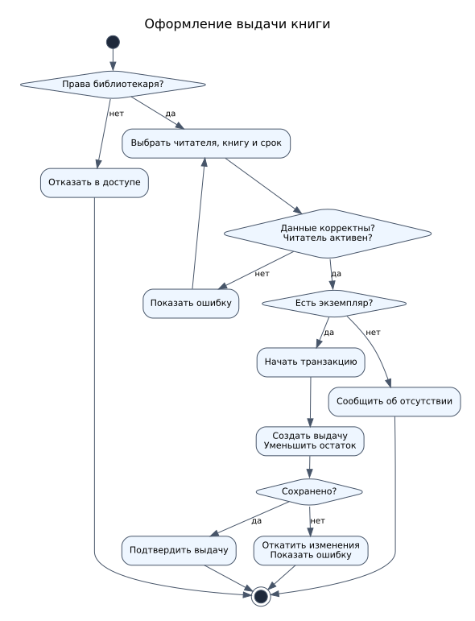
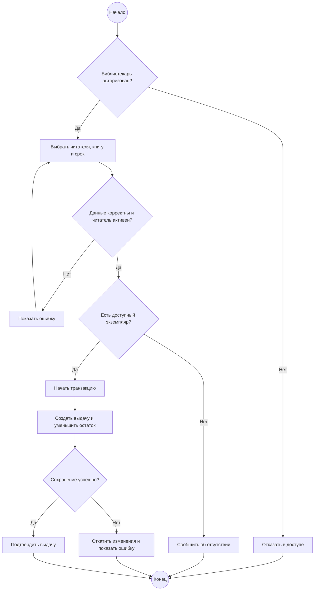
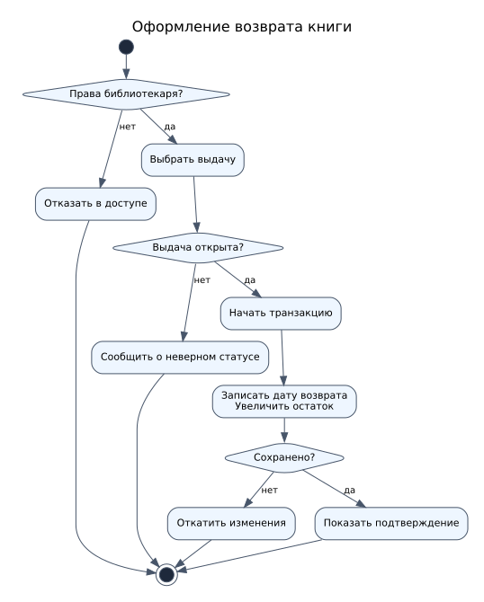
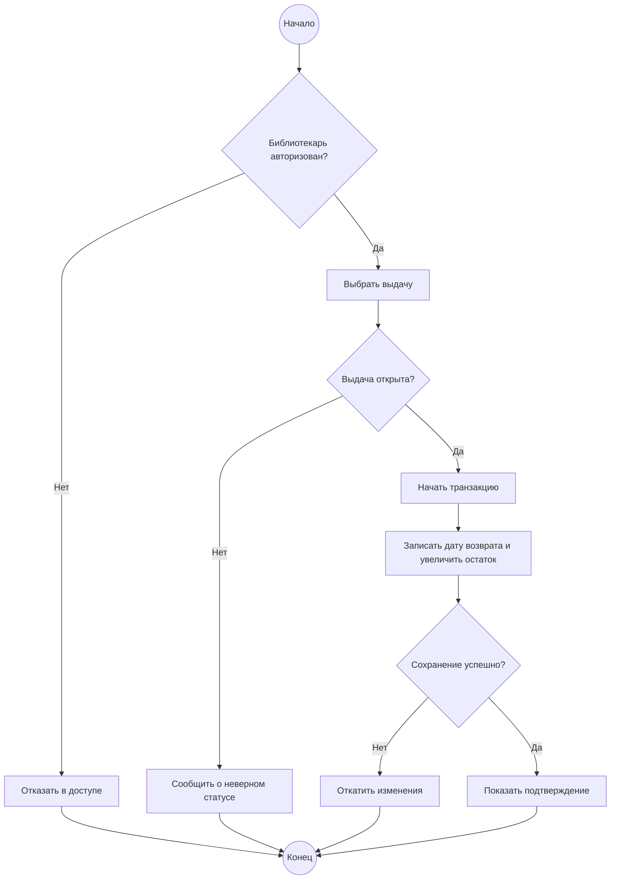

# UML — диаграммы деятельности

## Оформление выдачи книги

[Исходник DOT](uml/activity-issue.dot)

```mermaid
flowchart TD
    A((Начало)) --> B{Библиотекарь авторизован?}
    B -->|Нет| C[Отказать в доступе] --> Z((Конец))
    B -->|Да| D[Выбрать читателя, книгу и срок]
    D --> E{Данные корректны и читатель активен?}
    E -->|Нет| F[Показать ошибку] --> D
    E -->|Да| G{Есть доступный экземпляр?}
    G -->|Нет| H[Сообщить об отсутствии] --> Z
    G -->|Да| I[Начать транзакцию]
    I --> J[Создать выдачу и уменьшить остаток]
    J --> K{Сохранение успешно?}
    K -->|Нет| L[Откатить изменения и показать ошибку] --> Z
    K -->|Да| M[Подтвердить выдачу] --> Z
```

## Оформление возврата

[Исходник DOT](uml/activity-return.dot)

```mermaid
flowchart TD
    A((Начало)) --> B{Библиотекарь авторизован?}
    B -->|Нет| C[Отказать в доступе] --> Z((Конец))
    B -->|Да| D[Выбрать выдачу]
    D --> E{Выдача открыта?}
    E -->|Нет| F[Сообщить о неверном статусе] --> Z
    E -->|Да| G[Начать транзакцию]
    G --> H[Записать дату возврата и увеличить остаток]
    H --> I{Сохранение успешно?}
    I -->|Нет| J[Откатить изменения] --> Z
    I -->|Да| K[Показать подтверждение] --> Z
```
