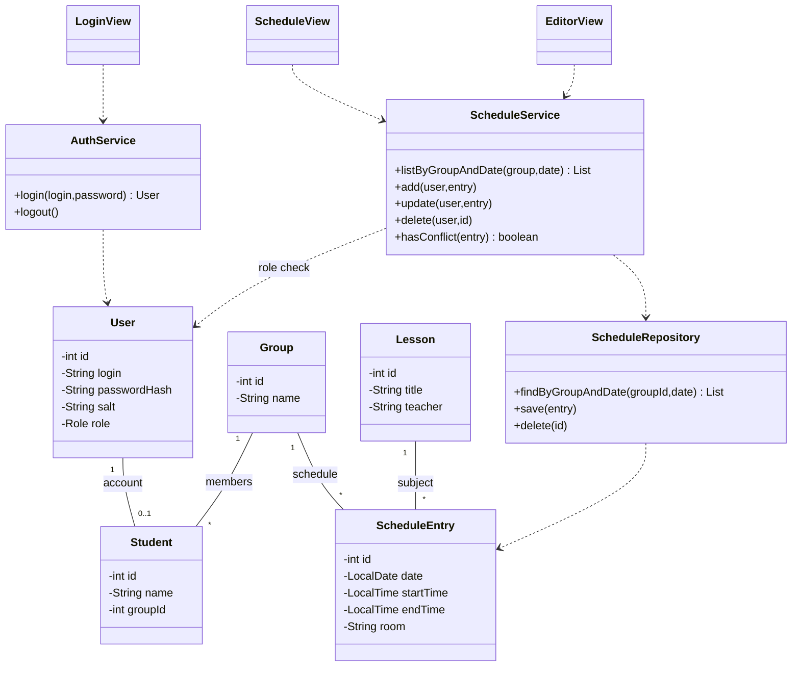

# UML — диаграмма классов

```mermaid
classDiagram
    class User {
        -int id
        -String login
        -String passwordHash
        -String salt
        -Role role
    }
    class Student {
        -int id
        -String name
        -int groupId
    }
    class Group {
        -int id
        -String name
    }
    class Lesson {
        -int id
        -String title
        -String teacher
    }
    class ScheduleEntry {
        -int id
        -LocalDate date
        -LocalTime startTime
        -LocalTime endTime
        -String room
    }
    class AuthService {
        +login(login,password) User
        +logout()
    }
    class ScheduleService {
        +listByGroupAndDate(group,date) List
        +add(user,entry)
        +update(user,entry)
        +delete(user,id)
        +hasConflict(entry) boolean
    }
    class ScheduleRepository {
        +findByGroupAndDate(groupId,date) List
        +save(entry)
        +delete(id)
    }
    class LoginView
    class ScheduleView
    class EditorView
    User "1" -- "0..1" Student : account
    Group "1" -- "*" Student : members
    Group "1" -- "*" ScheduleEntry : schedule
    Lesson "1" -- "*" ScheduleEntry : subject
    AuthService ..> User
    ScheduleService ..> ScheduleRepository
    ScheduleService ..> User : role check
    ScheduleRepository ..> ScheduleEntry
    LoginView ..> AuthService
    ScheduleView ..> ScheduleService
    EditorView ..> ScheduleService
```

Основные сущности хранят данные, сервисы отвечают за правила доступа и валидацию, репозиторий работает с SQLite. Представления JavaFX вызывают сервисы.
