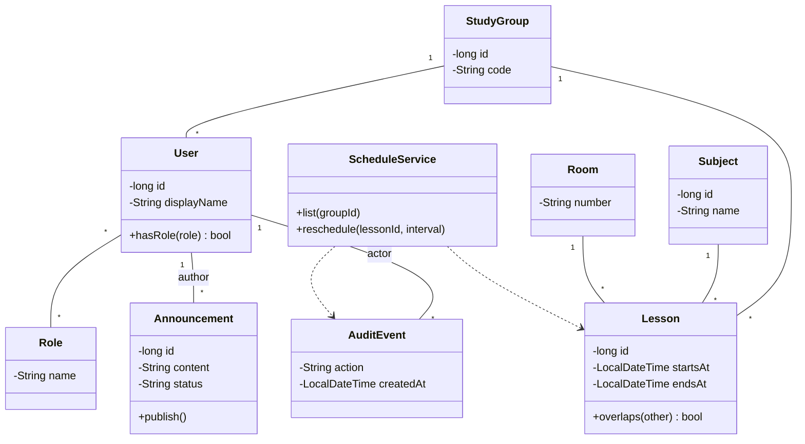

# Диаграмма классов Student Portal

```mermaid
classDiagram
 class User {
   -long id
   -String displayName
   +hasRole(role) bool
 }
 class Role {
   -String name
 }
 class StudyGroup {
   -long id
   -String code
 }
 class Subject {
   -long id
   -String name
 }
 class Lesson {
   -long id
   -LocalDateTime startsAt
   -LocalDateTime endsAt
   +overlaps(other) bool
 }
 class Room {
   -String number
 }
 class Announcement {
   -long id
   -String content
   -String status
   +publish()
 }
 class ScheduleService {
   +list(groupId)
   +reschedule(lessonId, interval)
 }
 class AuditEvent {
   -String action
   -LocalDateTime createdAt
 }
 User "*" -- "*" Role
 StudyGroup "1" -- "*" User
 StudyGroup "1" -- "*" Lesson
 Subject "1" -- "*" Lesson
 Room "1" -- "*" Lesson
 User "1" -- "*" Announcement : author
 User "1" -- "*" AuditEvent : actor
 ScheduleService ..> Lesson
 ScheduleService ..> AuditEvent
```

Логическая проектная модель, а не утверждение о точном составе классов существующего репозитория.
