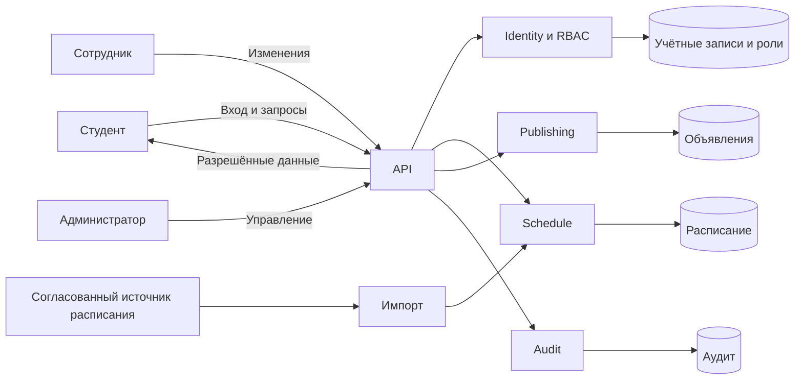

# Уровни и потоки данных

```mermaid
flowchart LR
 ST[Студент] -->|Вход и запросы| API[API]
 EMP[Сотрудник] -->|Изменения| API
 ADM[Администратор] -->|Управление| API
 SOURCE[Согласованный источник расписания] --> IMPORT[Импорт]
 API --> AUTH[Identity и RBAC]
 API --> SCHEDULE[Schedule]
 API --> NEWS[Publishing]
 API --> LOG[Audit]
 AUTH --> ACC[(Учётные записи и роли)]
 IMPORT --> SCHEDULE
 SCHEDULE --> DB[(Расписание)]
 NEWS --> PUB[(Объявления)]
 LOG --> AUD[(Аудит)]
 API -->|Разрешённые данные| ST
```
