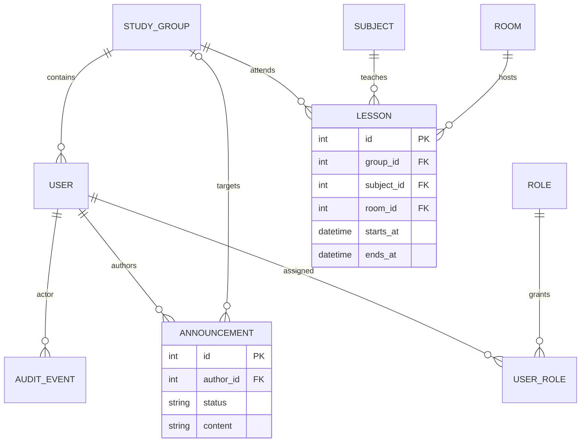

# Информационная модель

```mermaid
erDiagram
 USER ||--o{ USER_ROLE : assigned
 ROLE ||--o{ USER_ROLE : grants
 STUDY_GROUP ||--o{ USER : contains
 STUDY_GROUP ||--o{ LESSON : attends
 SUBJECT ||--o{ LESSON : teaches
 ROOM ||--o{ LESSON : hosts
 USER ||--o{ ANNOUNCEMENT : authors
 STUDY_GROUP o|--o{ ANNOUNCEMENT : targets
 USER ||--o{ AUDIT_EVENT : actor
 LESSON {
   int id PK
   int group_id FK
   int subject_id FK
   int room_id FK
   datetime starts_at
   datetime ends_at
 }
 ANNOUNCEMENT {
   int id PK
   int author_id FK
   string status
   string content
 }
```
