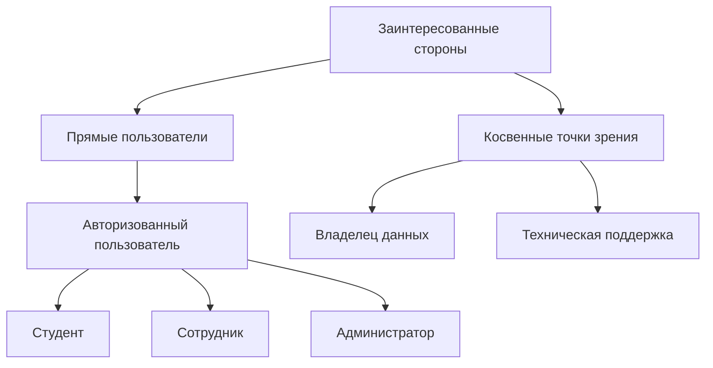

# VORD Иерархия точек зрения

```mermaid
flowchart TD
 ROOT[Заинтересованные стороны] --> DIRECT[Прямые пользователи]
 ROOT --> INDIRECT[Косвенные точки зрения]
 DIRECT --> COMMON[Авторизованный пользователь]
 COMMON --> STUDENT[Студент]
 COMMON --> EMPLOYEE[Сотрудник]
 COMMON --> ADMIN[Администратор]
 INDIRECT --> OWNER[Владелец данных]
 INDIRECT --> SUPPORT[Техническая поддержка]
```
