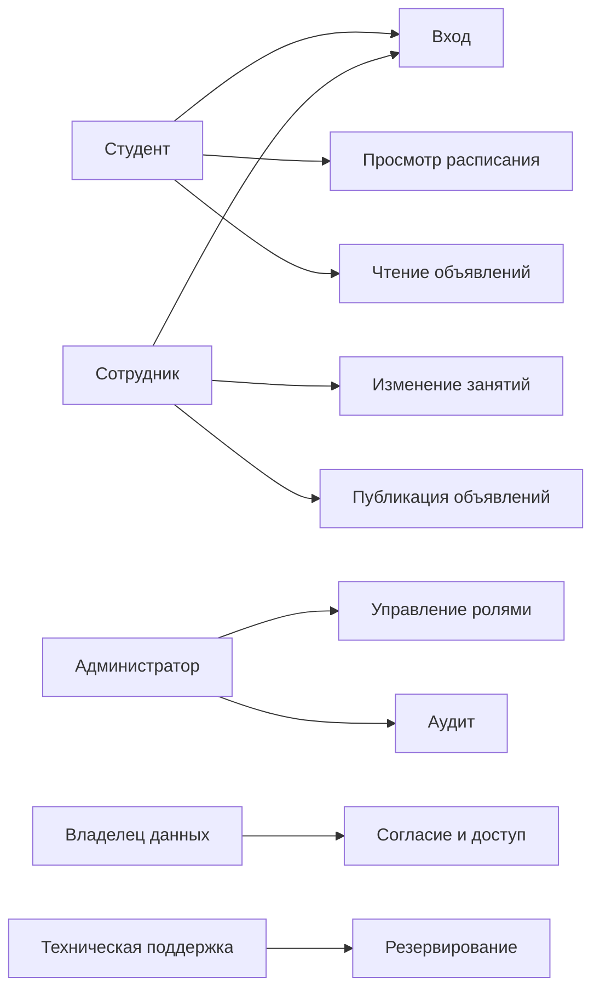

# VORD Идентификация точек зрения

```mermaid
flowchart LR
 student[Студент] --> login[Вход]
 student --> read[Просмотр расписания]
 student --> announcements[Чтение объявлений]
 staff[Сотрудник] --> login
 staff --> editing[Изменение занятий]
 staff --> publish[Публикация объявлений]
 admin[Администратор] --> roles[Управление ролями]
 admin --> audit[Аудит]
 owner[Владелец данных] --> privacy[Согласие и доступ]
 support[Техническая поддержка] --> backup[Резервирование]
```
