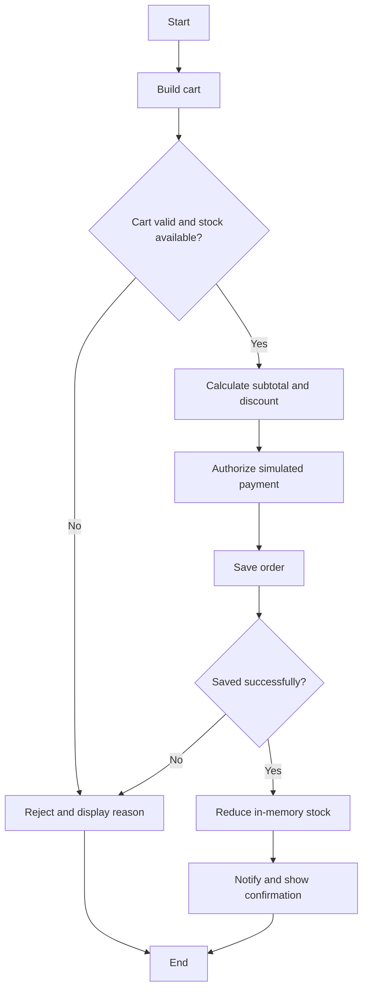

# Activity

```mermaid
flowchart TD
 A[Start] --> B[Build cart]
 B --> C{Cart valid and stock available?}
 C -->|No| D[Reject and display reason]
 C -->|Yes| E[Calculate subtotal and discount]
 E --> F[Authorize simulated payment]
 F --> G[Save order]
 G --> H{Saved successfully?}
 H -->|No| D
 H -->|Yes| I[Reduce in-memory stock]
 I --> J[Notify and show confirmation]
 D --> Z[End]
 J --> Z
```
