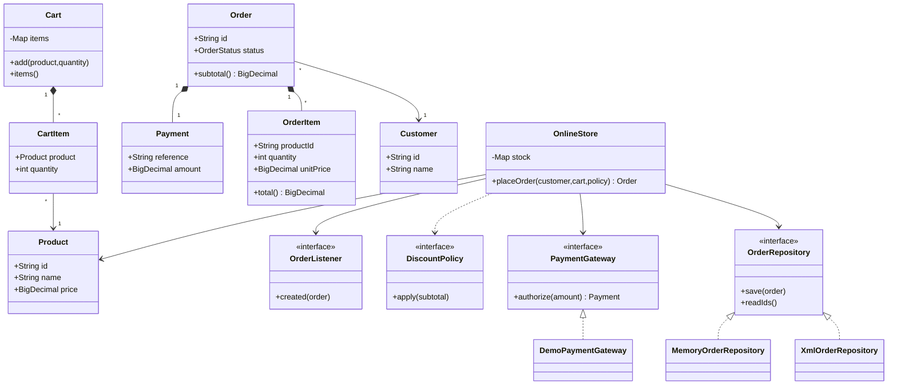

# Class diagram

```mermaid
classDiagram
 class Customer {
  +String id
  +String name
 }
 class Product {
  +String id
  +String name
  +BigDecimal price
 }
 class Cart {
  -Map items
  +add(product,quantity)
  +items()
 }
 class CartItem {
  +Product product
  +int quantity
 }
 class Order {
  +String id
  +OrderStatus status
  +subtotal() BigDecimal
 }
 class OrderItem {
  +String productId
  +int quantity
  +BigDecimal unitPrice
  +total() BigDecimal
 }
 class Payment {
  +String reference
  +BigDecimal amount
 }
 class OnlineStore {
  -Map stock
  +placeOrder(customer,cart,policy) Order
 }
 class OrderRepository {
  <<interface>>
  +save(order)
  +readIds()
 }
 class DiscountPolicy {
  <<interface>>
  +apply(subtotal)
 }
 class PaymentGateway {
  <<interface>>
  +authorize(amount) Payment
 }
 class OrderListener {
  <<interface>>
  +created(order)
 }
 Cart "1" *-- "*" CartItem
 CartItem "*" --> "1" Product
 Order "*" --> "1" Customer
 Order "1" *-- "*" OrderItem
 Order "1" *-- "1" Payment
 OnlineStore --> OrderRepository
 OnlineStore --> PaymentGateway
 OnlineStore ..> DiscountPolicy
 OnlineStore --> OrderListener
 OnlineStore --> Product
 OrderRepository <|.. XmlOrderRepository
 OrderRepository <|.. MemoryOrderRepository
 PaymentGateway <|.. DemoPaymentGateway
```
