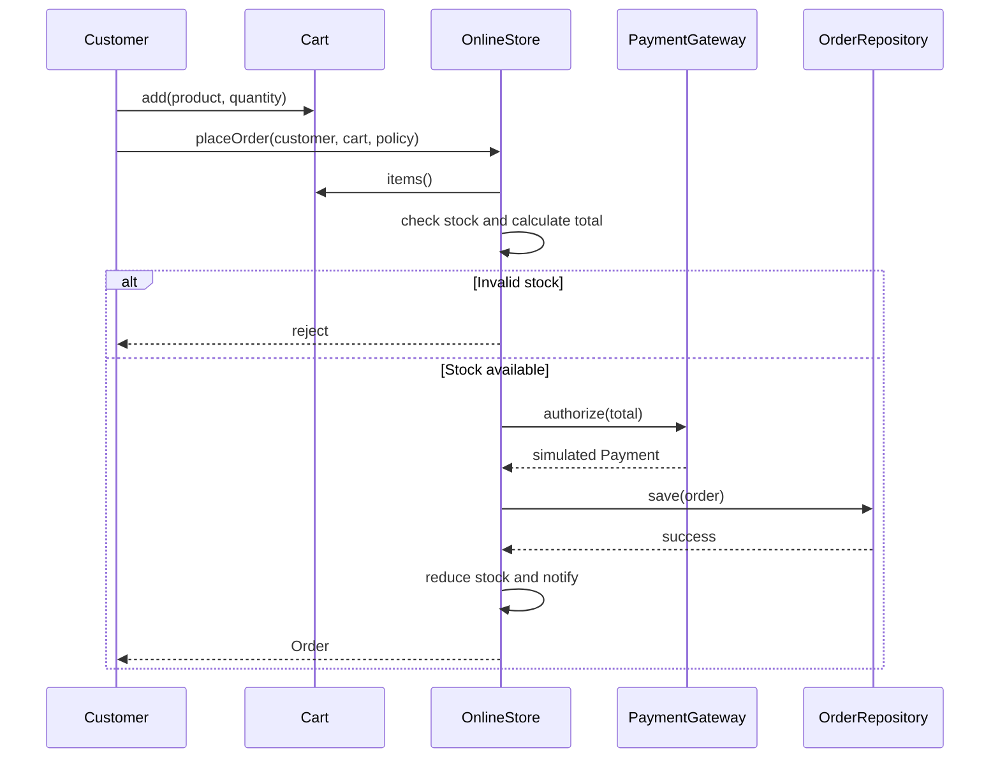

# Sequence

```mermaid
sequenceDiagram
 participant Customer
 participant Cart
 participant Store as OnlineStore
 participant Gateway as PaymentGateway
 participant Repo as OrderRepository
 Customer->>Cart: add(product, quantity)
 Customer->>Store: placeOrder(customer, cart, policy)
 Store->>Cart: items()
 Store->>Store: check stock and calculate total
 alt Invalid stock
   Store-->>Customer: reject
 else Stock available
   Store->>Gateway: authorize(total)
   Gateway-->>Store: simulated Payment
   Store->>Repo: save(order)
   Repo-->>Store: success
   Store->>Store: reduce stock and notify
   Store-->>Customer: Order
 end
```
