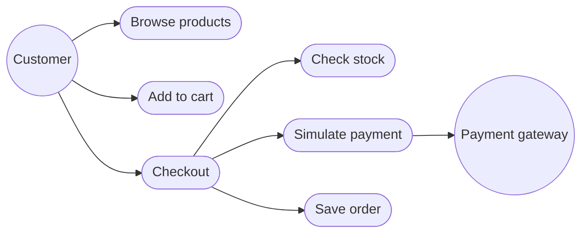

# Use case

```mermaid
flowchart LR
 Customer((Customer)) --> Browse([Browse products])
 Customer --> Add([Add to cart])
 Customer --> Checkout([Checkout])
 Checkout --> Reserve([Check stock])
 Checkout --> Pay([Simulate payment])
 Checkout --> Save([Save order])
 Pay --> Gateway((Payment gateway))
```
